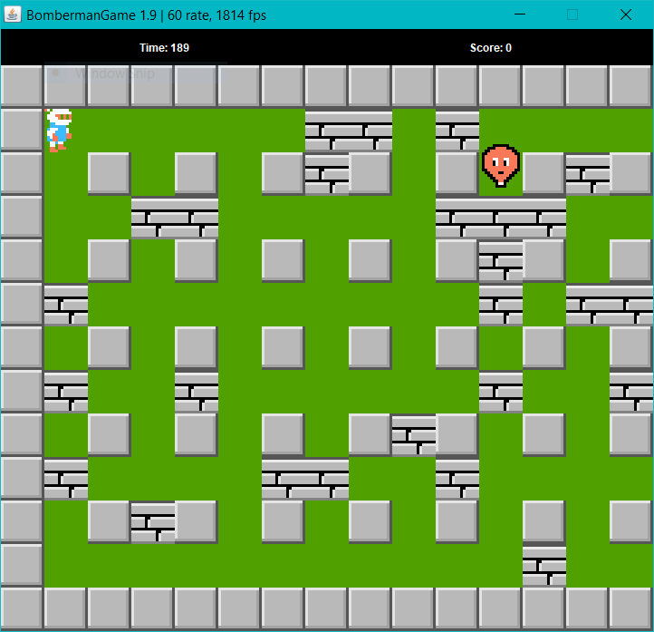

# Lớp học phần: INT2204 20 - Lập trình hướng đối tượng

# Bài tập lớn OOP - Bomberman Game - OOP_N4_BTL_N2

| STT | Tên thành viên      | MSV        | Phần công việc đảm nhận                                | Percentage |
|-----|---------------------|------------|--------------------------------------------------------|------------|
| 1   | Nguyễn Đăng Quang   | 21020785   | Map, Block, Items, Control, AI Move, Github Management | 40%        |
| 2   | Ma Thanh Thiện      | 21020794   | Map, Monster, Bomber, Control, Items, Levels, Testing  | 40%        |
| 3   | Hoàng Thanh Tùng    | 21021661   | Menu, Levels                                           | 20%        |

Trong bài tập lớn này, nhiệm vụ của bạn là viết một phiên bản Java mô phỏng lại trò
chơi [Bomberman](https://www.youtube.com/watch?v=mKIOVwqgSXM) kinh điển của NES.

Bạn có thể sử dụng mã nguồn tại repository này để phát triển hoặc tự phát triển từ đầu.

## Các đối tượng trong trò chơi Bomberman

Các đối tượng chính của trò chơi Bomberman như sau:

-  *Bomber* là nhân vật chính của trò chơi. Bomber có thể di chuyển theo 4 hướng
  trái/phải/lên/xuống theo sự điều khiển của người chơi.

-  *Enemy* là các đối tượng mà Bomber phải tiêu diệt hết để có thể qua Level. Enemy có
  thể di chuyển ngẫu nhiên hoặc tự đuổi theo Bomber tùy theo loại Enemy. Các loại Enemy sẽ được mô tả cụ thể ở phần
  dưới.

-  *Bomb* là đối tượng mà Bomber sẽ đặt và kích hoạt tại các ô Grass. Khi đã được kích hoạt,
  Bomber và Enemy không thể di chuyển vào vị trí Bomb. Tuy nhiên ngay khi Bomber vừa đặt và kích hoạt Bomb tại ví trí
  của mình, Bomber có một lần được đi từ vị trí đặt Bomb ra vị trí bên cạnh. Sau khi kích hoạt 2s, Bomb sẽ tự nổ, các
  đối tượng *Flame*  được tạo ra.

-  *Grass* là đối tượng mà Bomber và Enemy có thể di chuyển xuyên qua, và cho phép đặt Bomb
  lên vị trí của nó

-  *Wall* là đối tượng cố định, không thể phá hủy bằng Bomb cũng như không thể đặt Bomb lên
  được, Bomber và Enemy không thể di chuyển vào đối tượng này

-  *Brick* là đối tượng được đặt lên các ô Grass, không cho phép đặt Bomb lên nhưng có thể bị
  phá hủy bởi Bomb được đặt gần đó. Bomber và Enemy thông thường không thể di chuyển vào vị trí Brick khi nó chưa bị phá
  hủy.

-  *Portal* là đối tượng được giấu phía sau một đối tượng Brick. Khi Brick đó bị phá hủy,
  Portal sẽ hiện ra và nếu tất cả Enemy đã bị tiêu diệt thì người chơi có thể qua Level khác bằng cách di chuyển vào vị
  trí của Portal.

Các *Item* cũng được giấu phía sau Brick và chỉ hiện ra khi Brick bị phá hủy. Bomber có thể sử dụng Item bằng cách di
chuyển vào vị trí của Item. Thông tin về chức năng của các Item được liệt kê như dưới đây:

-  *SpeedItem* Khi sử dụng Item này, Bomber sẽ được tăng vận tốc di chuyển thêm một
  giá trị thích hợp
-  *FlameItem* Item này giúp tăng phạm vi ảnh hưởng của Bomb khi nổ (độ dài các Flame
  lớn hơn)
-  *WallPassItem* Item này giúp cho Bomber đi xuyên qua những ô gạch, không xuyên
qua các ô tường, và có thể đặt bom trên các ô gạch

Các loại Monster tương ứng đã cài trong game Bomberman

-  *Balloom* là Enemy đơn giản nhất, di chuyển ngẫu nhiên với vận tốc cố định
-  *Oneal* di chuyển "thông minh" hơn so với Balloom (biết đuổi theo Bomber)
-  *Doll* di chuyển với vận tốc giảm đi một nửa so với *Ballom*, "kém thông minh" hơn Balloom
-  *Minvo* di chuyển với vận tốc cao x2 so với Ballom
-  *Kondoria* là Enemy có thể di chuyển xuyên qua gạch và *Bomb*

## Game Logic
- Bomber được điều khiển bằng các phím mũi tên và phím SPACE để đặt bom. Nhiệm vụ của Bomber là phải tiêu diệt hết các
Monster, khi đó cửa (*Portal*) sẽ hiện ra để đi đến Level tiếp theo

- Bomb: Khi bomb nổ, các đối tượng Flame sẽ được tạo ra, phá hủy gạch và tiêu diệt Bomber/ Monsters nếu đi vào
vùng có Flames

- Các loại Monster khác nhau của trò chơi, với những thuộc tính khác nhau

## Chức năng
- Đã hoàn thành:
    + Xây dựng bản đồ chơi từ file txt cấu hình tự định nghĩa
    + Di chuyển Bomber theo sự điều khiển từ người chơi (Phím mũi tên, SPACE)
    + Tự động di chuyển các Monster
    + Xử lý va chạm khi Bomb nổ, xử lý va chạm cho các đối tượng tĩnh
    + Xử lý Bomber khi sử dụng các Item và đi vào vị trí Portal
    + Cài đặt thuật toán tìm đường cho Monster (Cụ thể là Oneal)
    + Cài đặt thêm các loại Monster khác với chức năng riêng
    + Xây dựng Sound Effects
    + Cài đặt Menu, tính năng High Score
- Chưa hoàn thành:
    + Thuật toán AI cho Bomber
    + 2 players chơi với nhau
    + Chọn các loại quái, loại Bomber khác nhau
    + Phát triển hệ thống Server - Client

## UML Class Diagram

## Các phần mềm đã sử dụng
- Ngôn ngữ lập trình: [JAVA](https://www.java.com/en/)
- IDE: [IntelliJ IDEA](https://www.jetbrains.com/idea/)
- Thư viện: [JavaFX](https://openjfx.io/)

